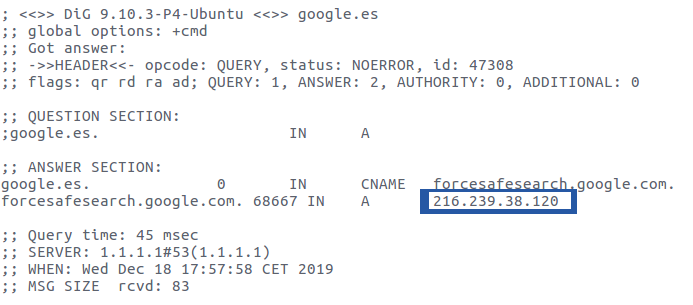

# Actividad de solicitudes 

>usuado el comando dig en los sistemas operativos Linux

## Tipos de registros 
    dig <server o ipserver> <Tipo de registro>
 >no valido 
* Ejemplo

        dig google.es
        

[Volver a la página](README.md)

1. Mira la direcion ip del servidor de boe.es
1. Ahora delante del dig ponemos "-x" y la direcion del boe
1. Mira 

>Lo valido 

Vamos a ver quien es el host del servidor(ver la direcion ip del servidor DNS de una pagina web?) para ello pondremos:

        dig <nombre_web.com> A

Esa pagina tiene un servidor de correo ? para saberlo introduciremos el siguiente comando

        dig <nombre_web.com> MX

