# Actividad de Registro

>usuado el comando dig en los sistemas operativos Linux

    dig <server o ipserver> <Tipo de registro>
    
## Tipos de registros 
 
Vamos a ver quien es el host del servidor(ver la direcion ip del servidor DNS de una pagina web) para ello pondremos:

        dig <nombre_web.com> A

Tambien existe los registro AAAA que lo unico que difiere con los regidtros A es que en vez de ser IPv4 es en IPv6

        dig <nombre_web.com> AAAA

Esa pagina tiene un servidor de correo ? para saberlo introduciremos el siguiente comando

        dig <nombre_web.com> MX

Ahora vamos ha ver que servidor DNS el que manaeja los registros de recuerso de la pagina web , esto lo consegimos ejecutando esto :

        dig <nombre_web.com> SOA
        
Veremos el nombre o nombres de servidor DNS de la pagina web , con el siguiente comando: 

        dig <nombre_web.com> NS

Para saber si utiliza un alias el servidor DNS , es poniendo :

        dig <nombre_web.com> CNAME

Para hacer la conversion de direcion IP a nombre es con :

        dig -x <IP_host> 

Para ver todos los registros DNS de la pagina web , ejecutando este comando : 

        dig <nombre_web.com> ANY
        
## Ejemplos

usaundo google.com

1. dig google.com A

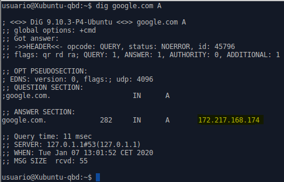

2.dig google.com AAAA

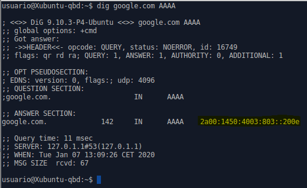

3.dig google.com MX

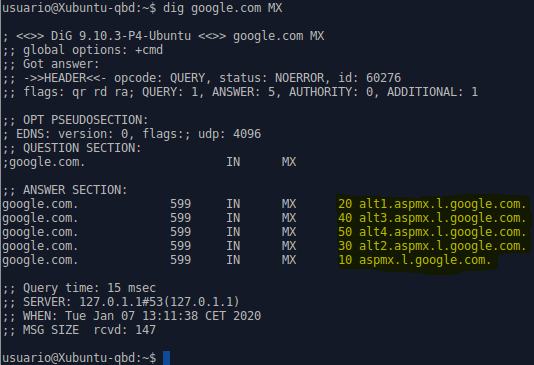

4.dig google.com SOA

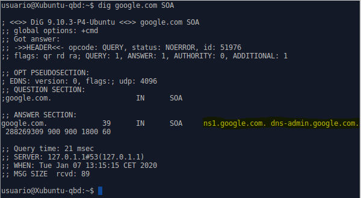

5.dig google.com NS

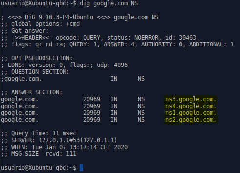

 6.dig google.com CNAME
 
 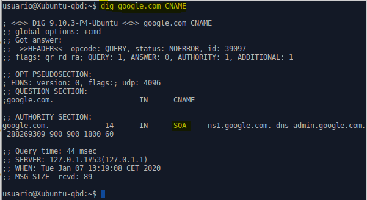
 
 En mi ejemplo google.com no tiene alias pero usaundo otra pagina si que me sale con alias , la pagina que use fue ionos. 
 
  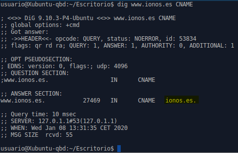
 
Pero si lo hacia sin las 3 w no me da ningun alias ya que el alis que nos indica es si las 3 w.

 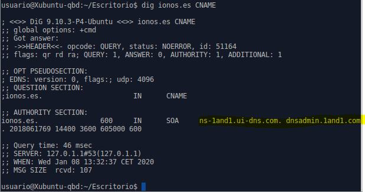
 
7.dig -x 172.217.168.174

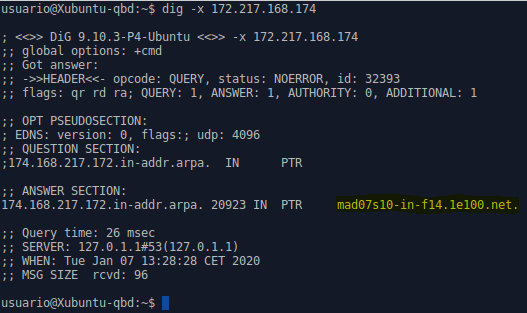

Google usa ese estilo de llamar a sus dispositivos de su red

Tambien se puede hacer la conversion usando la direcion de IPv6

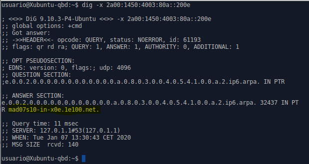

8.dig google.com ANY

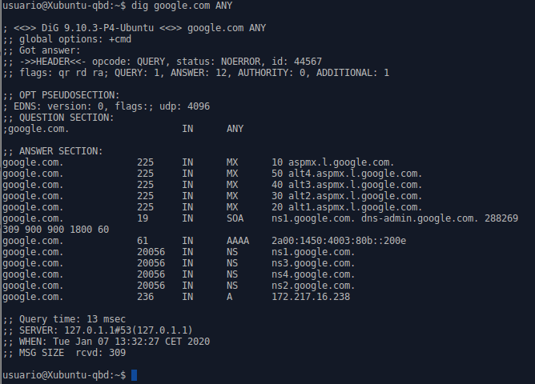

